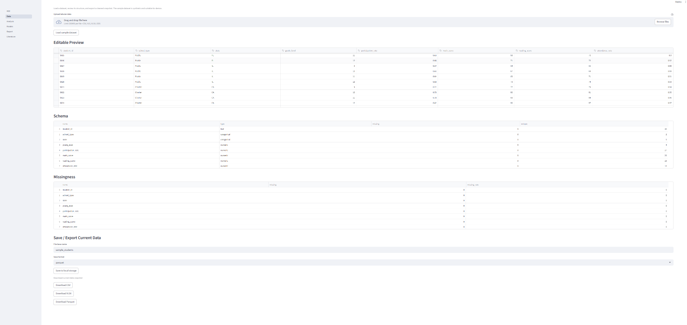
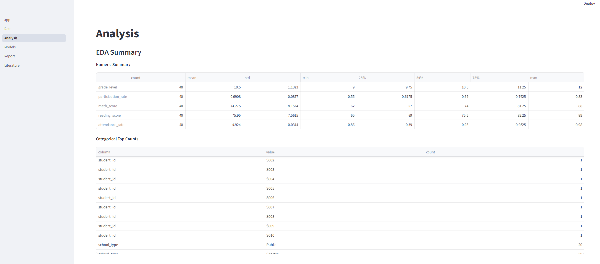
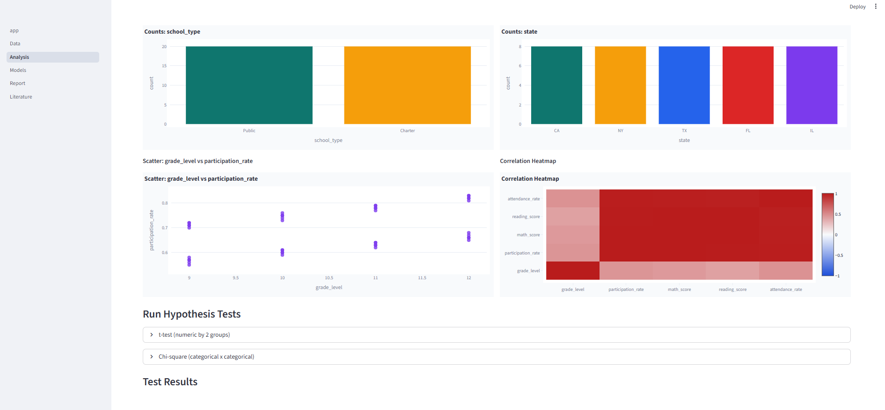
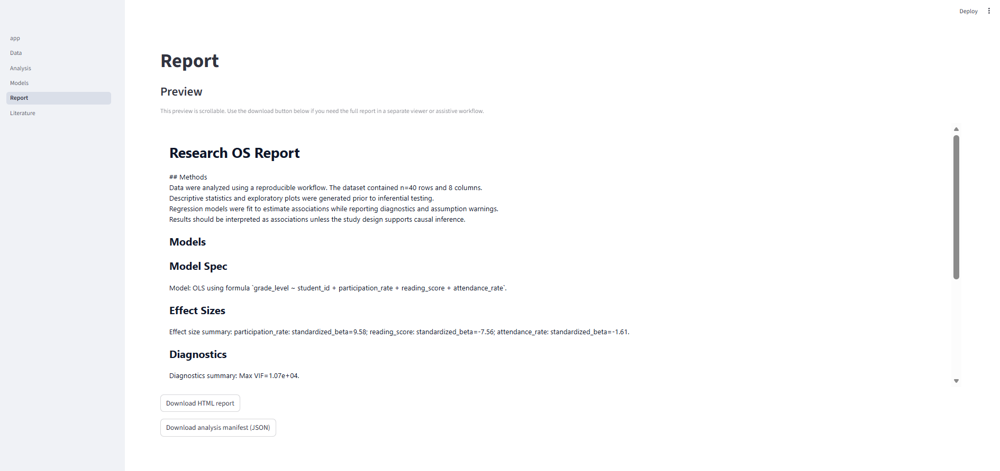
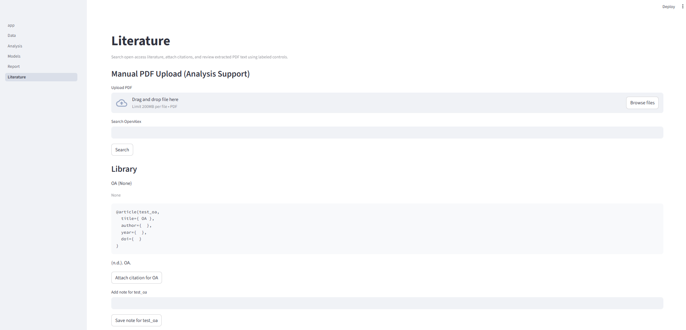

# Research OS

Research OS is a local-first research workflow for quantitative social-science analysis. Its mission is to give nonprofits, universities, researchers, students, and public-interest teams a free or low-cost tool they can run, inspect, modify, and adapt without buying an expensive analytics platform.

The project is meant to reduce software costs for mission-driven work while keeping research outputs transparent, reproducible, and cautious.

## The Problem

Many research and public-interest teams need to load tabular data, inspect missingness, run common statistical tests, fit regression models, connect findings to literature, and export a defensible report. Commercial tools that cover parts of this workflow can be expensive, closed, difficult to audit, or tied to cloud services that create privacy and procurement barriers.

This matters for:

- nonprofits that need evidence for grants, program evaluation, and advocacy;
- universities and students who need reproducible workflows without per-seat software costs;
- researchers working with survey, observational, administrative, or education data;
- public-interest teams that need local control over files, methods, and outputs;
- civic technologists and community organizations that need practical tools they can modify.

Research OS addresses workflow cost and transparency. It does not remove the need for statistical review, privacy review, security hardening, or subject-matter judgment.

## What This Solves

Research OS gives users one local workflow for:

- loading CSV, XLS, XLSX, and ODS datasets;
- editing and exporting cleaned data snapshots;
- inspecting schema, missingness, summaries, correlations, and plots;
- running two-sample t-tests and chi-square tests;
- fitting OLS and logistic regression models;
- attaching deterministic methods-coach text with assumptions, warnings, limitations, and next steps;
- searching OpenAlex metadata and downloading open-access PDFs only;
- storing local literature metadata, notes, PDFs, and citations;
- exporting an HTML report and a JSON analysis manifest.

The goal is not to automate final research decisions. The software helps assemble evidence and structured interpretation so a researcher, instructor, nonprofit analyst, or public-interest team can review the work more efficiently.

## Who It Is For

- Nonprofits doing program evaluation, reporting, or policy analysis
- Universities, labs, instructors, and methods courses
- Researchers using structured social, education, civic, health-adjacent, or policy data
- Students learning reproducible quantitative workflows
- Public-interest teams and civic technologists
- Community organizations that need inspectable, adaptable tools
- Independent analysts who prefer local-first research software

The repo is not intended for surveillance, predictive policing, individual risk scoring, automated interventions, or operational decision systems.

## Free / Low-Cost Use

This project is licensed under the MIT License. The license permits use, copying, modification, merging, publishing, distribution, sublicensing, and sale of copies of the software, provided the copyright notice and permission notice are included in copies or substantial portions of the software.

That means users may clone, fork, run, modify, and deploy Research OS for free or low-cost public-interest work, subject to the MIT License terms. The software is provided "as is" without warranty.

No maintainer email, security email, organization contact, or funding contact is present in this repository. The metadata files contain placeholder repository URLs such as `https://github.com/your-org/research-os`.

## What Is Included

- Streamlit frontend with Home, Data, Analysis, Models, Report, and Literature pages
- FastAPI backend with `/stats` and `/literature` routes
- Statistical engine for schema detection, missingness summaries, EDA, correlations, Plotly charts, t-tests, chi-square tests, OLS, logistic regression, diagnostics, effect sizes, and report generation
- Deterministic Methods + Assumptions Coach for cautious methods language, limitations, diagnostics summaries, and next steps
- Literature tools for OpenAlex search, OA PDF resolution, OA-only PDF download, PDF text extraction/search, SQLite-backed local library, notes, BibTeX export, and APA-style citation text
- Data import for CSV, XLS, XLSX, and ODS
- Data export to CSV, XLSX, and Parquet, with JSON schema sidecars
- HTML report export and JSON analysis manifest export
- Synthetic sample dataset at `data/sample_students.csv`
- Screenshots under `docs/screenshots/`
- Startup and stop scripts for Windows and Unix-like shells
- Tests for stats, data I/O, report generation, literature helpers, and API/UI flow contracts
- Documentation for usage, architecture, methods limits, accessibility, contribution, security, and privacy

Planned or aspirational items in older specification language should not be treated as production guarantees unless they are implemented in code and covered by tests.

## Screenshots

### Data Workflow


### Analysis Summary


### Analysis Plots


### Report Preview


### Literature Support


## Compliance and Trust Posture

Research OS is compliance-aware, not compliance-certified. The repository contains practical guardrails for local-first use, open-access literature handling, accessible labels and text outputs, HTML escaping in reports, and tests around several core workflows. Deployers remain responsible for legal, privacy, accessibility, security, procurement, and domain-specific review before production use.

### GDPR

GDPR may matter if a deployer processes personal data from people in the European Economic Area or handles research data that can identify individuals. The repo is local-first and ignores `.env`, runtime storage, exports, PDFs, databases, and local research datasets by default. It includes a synthetic demo dataset and methods guidance warning users to avoid personally identifiable information.

What remains: deployers must define lawful basis, consent or ethics approval where needed, data minimization, retention, access controls, data subject rights handling, processor/controller roles, cross-border transfer review, and breach response.

### European Accessibility Act / EN 301 549

Accessibility matters for universities, public-sector teams, and public-facing tools. The repo includes `ACCESSIBILITY.md`, uses labeled Streamlit controls in many places, provides text summaries alongside charts, and includes descriptive alt text for README screenshots.

What remains: the project has not been audited or certified for EN 301 549. Deployers need keyboard, screen-reader, contrast, chart accessibility, browser zoom, and assistive-technology testing before relying on it in covered public services.

### EU AI Act

The project includes deterministic generated interpretation text from `stats_engine/methods_coach.py`. It does not call an external AI model, train a model, or make automated decisions. The methods coach should be treated as AI-adjacent or automated assistance for drafting cautious research language, not as final professional judgment.

What remains: deployers using the tool in education, public-sector, health, employment, legal, or other regulated settings must review whether their use case triggers EU AI Act obligations. If external AI features are added later, model documentation, risk classification, human oversight, logging, data governance, and output review will need fresh assessment.

### NIS2 Directive

NIS2 may matter if an organization deploys this for essential or important services, university infrastructure, public administration, or other covered sectors. The repo currently runs local Streamlit and FastAPI services and has no user accounts, role-based access control, or infrastructure security program.

What remains: covered organizations must handle governance, incident reporting, vulnerability management, supply-chain security, business continuity, backup/restore, logging, access control, and operational monitoring outside this repo.

### Cyber Resilience Act

The Cyber Resilience Act may matter if this software is distributed as a product with digital elements in the EU. The repo includes source code, dependency declarations, tests, a security policy, and a production readiness checklist, but it does not provide a formal secure development lifecycle or conformity assessment.

What remains: distributors must review vulnerability handling, update mechanisms, SBOM/dependency tracking, secure defaults, documentation duties, and any applicable conformity obligations.

### Section 508 / WCAG 2.1 AA

Section 508 and WCAG 2.1 AA matter for US public-sector, federally funded, and education deployments. The repo documents current accessibility strengths and gaps in `ACCESSIBILITY.md`.

What remains: Research OS is not certified Section 508 compliant and has not completed a WCAG 2.1 AA audit. Deployers need formal accessibility testing, especially for Streamlit widgets, `st.data_editor`, Plotly charts, dense tables, focus order, contrast, and keyboard-only workflows.

### NIST SP 800-53

NIST SP 800-53 may matter for federal, public-sector, university, or grant-funded systems. The repo has some useful pieces for control planning: local-first storage, ignored local data, tests, MIT-licensed source, and basic security documentation.

What remains: it does not implement a full control baseline. Deployers must assess access control, audit logging, configuration management, identification and authentication, incident response, media protection, risk assessment, system communications protection, and continuous monitoring.

### NIST Cybersecurity Framework

The repo can support parts of Identify and Protect through open code, documented architecture, dependency files, and local storage defaults. It does not provide a complete Detect, Respond, or Recover program.

What remains: deployers need asset inventory, dependency scanning, threat modeling, log review, incident response playbooks, backup and recovery procedures, and security ownership.

### FedRAMP Readiness

There is no FedRAMP authorization, readiness assessment, package, agency authorization, 3PAO assessment, or cloud boundary documentation in this repo. Any FedRAMP language should be treated only as planning.

What remains: a cloud deployment would need system boundary definition, control implementation, SSP work, continuous monitoring, vulnerability scanning, incident response, access control, audit logging, encryption, configuration baselines, and authorization planning.

## Current Status

Research OS should be treated as a research tool / proof-of-concept starter kit, not a production-ready regulated system.

Current limitations include:

- no authentication, authorization, user management, or multi-user isolation;
- no built-in TLS, CORS hardening, deployment manifests, or production reverse proxy configuration;
- no formal privacy, security, accessibility, FedRAMP, GDPR, EN 301 549, or WCAG certification;
- no audit log system for sensitive research workflows;
- no automated backup or restore workflow for `storage/`;
- no OCR for scanned PDFs;
- no external AI model integration, human-review workflow, or AI governance layer;
- tests cover core modules, but production operations and infrastructure are deployer responsibilities.

Use sample or de-identified data for demos. Do not use real sensitive personal, health, education, financial, legal, or public-sector data without appropriate review and controls.

## Quick Start

Requires Python 3.10+.

### Windows

```powershell
py -m pip install -U pip
py -m pip install -e .
py -m pip install -r requirements-dev.txt
run.bat
```

### Linux / macOS

```bash
bash setup.sh
bash run.sh
```

When startup succeeds, use the URLs printed by the run script. Defaults are near:

- Streamlit UI: `http://127.0.0.1:8501`
- FastAPI docs: `http://127.0.0.1:8000/docs`

To stop:

- Windows: `stop.bat`
- Linux / macOS: `bash stop.sh`

Manual commands are also available:

```bash
python -m streamlit run app_streamlit/app.py
python -m uvicorn api_fastapi.main:app --reload --port 8000
```

## Project Structure

- `app_streamlit/`: Streamlit UI and data I/O helpers
- `api_fastapi/`: FastAPI app, routers, and request schemas
- `stats_engine/`: schema, cleaning, EDA, tests, regression, diagnostics, effect sizes, interpretation, and report generation
- `literature/`: OpenAlex search, OA PDF download, SQLite library, notes, citation helpers, PDF text extraction, and PDF loading
- `data/`: synthetic sample dataset
- `docs/screenshots/`: README screenshots
- `scripts/`: bootstrap scripts that install dependencies, run tests, and start the app
- `tests/`: pytest suite
- `ACCESSIBILITY.md`: accessibility posture and known gaps
- `METHODS.md`: intended use, statistical limits, ethics, and interpretation guidance
- `PRIVACY.md`: local data and deployer privacy responsibilities
- `SECURITY.md`: vulnerability reporting and hardening guidance
- `docs/PRODUCTION_READINESS_CHECKLIST.md`: production review checklist

## Testing

Test commands found in the repo:

```bash
python -m pytest -q
make test
make test-cov
make lint
make type
make format
```

Latest local verification in this working tree:

```bash
py -m pytest -q
# 33 passed
```

`Status.md` also records an earlier broader coverage run with `89%` coverage. Run the tests in your own environment before relying on those results.

## License

[MIT License](LICENSE). The license allows free use, copying, modification, distribution, sublicensing, and sale of the software, provided the required copyright and permission notices are included. The software is provided without warranty.
